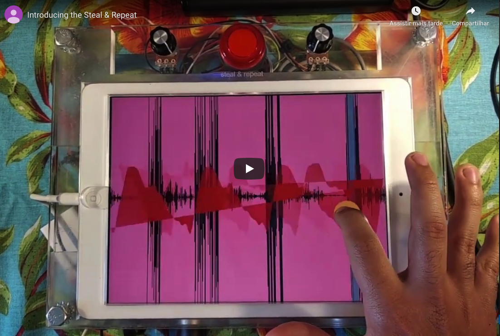

# Steal and Repeat

The Steal & Repeat Machine is a live looping tool based on direct manipulation of sound.

If you're interested, I also wrote a few words about the making of this project [here](./research/README.md).

## Technology used
- [C++/Openframeworks](https://openframeworks.cc/) v0.9.0;