# Documentation
I wrote a few words about the:
1. [iOS app:](#software) Presenting the C++ written app which drives the Steal & Repeat;
2. [Enclosuring:](#Enclosuring) Presenting the research that led to the plexiglass enclosure;
3. [Circuits:](#circuits) This section describes how to build a DIY controller that communicates with the iOS app;
4. [Audio IO & Powering:](#Audio-IO-&-Powering) Covering my approach to deal with audio input & output in the iPad and powering the whole system.

# iOS App
The iOS app was written in C++/Openframeworks (v0.9.0) and is presented in the video below:

You can find more about its design on my [NIME 2017 paper](https://jeraman.info/publication/playfulness-2017/playfulness-2017.pdf):
> Jeronimo Barbosa, Marcelo M. Wanderley, and Stéphane Huot. _“Exploring Playfulness in NIME Design: The Case of Live Looping Tools.”_ In Proceedings of the 2017 International Conference on New Interfaces for Musical Expression, Copenhagen, Denmark.

# Enclosuring
My initial idea was the following:

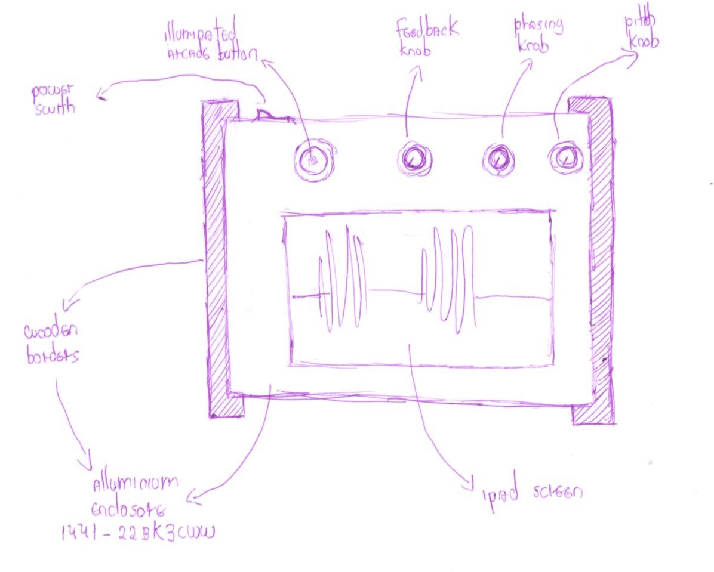

To concretize this idea, I decided to look for ready-made boxes that I could tweak. Edu introduced me to the [Hammond website](https://www.hammfg.com) containing has several different types of enclosures that can be used in DIY projects. Taking the measures of the iPad as a reference, I found three boxes (list [here](https://docs.google.com/spreadsheets/d/1D_RBQ6R6dxn2w-e68LABvtBa7pAwvGjO6KwVCHRj6x4/edit?usp=sharing)) that could potentially work for me. The detailed measures of the chosen box are:

## Iteration 1: Paper prototype
After discussing the measures with Darryl, I decided to start paper prototyping. First, I cut an letter-sized paper on the exact dimensions of the box. Then I have cut out holes in the size of the iPad screen, the buttons, and the potentiometers. The result is the following:

## Iteration 2: Cardboard prototype
Based on the paper prototype, I've built the following cardboard prototype:

This prototype provided a more concrete idea of the general look & feel. However, some important aspects remained unexplored. Namely:

### How to place the iPad under the top structure?
Here, I considered different solutions. One option would be [Jeffrey Stephenson's iPad TV box](http://slipperyskip.com/page38.html) (similar solution [here](https://www.youtube.com/watch?v=WuSLoM4i7Og)). Another would be to create a 'bed' on wood, and then cover it with a thin layer of plexiglass (such as [here](https://www.youtube.com/watch?v=Mjn0Njk-Nx8) and [here](https://www.youtube.com/watch?v=dWabuJQFBD0)). After a while, I decided to go with a sandwich of layers built with laser cutters, as shown in the image below:

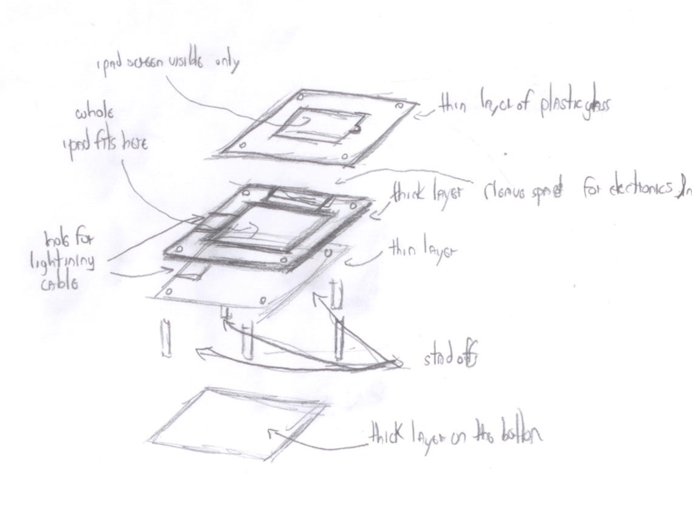

### How to hold still other hardware (i.e. FocusRite, USB hub, circuit) inside the enclosure?
Brainstormed solutions included: Sandwiching and against top and bottom parts; 3D printed case glued to bottom part; and wooden blocks to allow sandwich of the USB hub. In the end, the easiest solution was (again) sandwiching the FocusRite, and using some carving in the bottom layer to make it stand still. In my tests, the USB hub seems to stand still when all cables are connected.

### How to properly fix & separate bottom and upper layers?
Here I decided to use [standoffs/coupling nuts](https://www.mcmaster.com/#spacers-and-standoffs/=b5fq5j), the same strategy used by Ivan on his first Mitt prototype. Ivan told me I could find those on [Home Depot Beaubien](https://www.homedepot.ca/en/home/categories/building-materials/hardware/fasteners/nuts/coupling-nuts.html). As future reference, I was also able to find these standoffs on [Digikey](https://www.digikey.ca/products/en/hardware-fasteners-accessories/board-spacers-standoffs/582) Good models are [this one](https://www.digikey.ca/product-detail/en/wurth-electronics-inc/970500471/732-10662-ND/6174882) and [this one](https://www.digikey.ca/product-detail/en/wurth-electronics-inc/970500361/732-10661-ND/6174881), as they have approximately the height of the FocusRite. Their thread size is M3.

## Iteration 3: Paper prototype
Back to paper prototype to investigate the solutions proposed above:

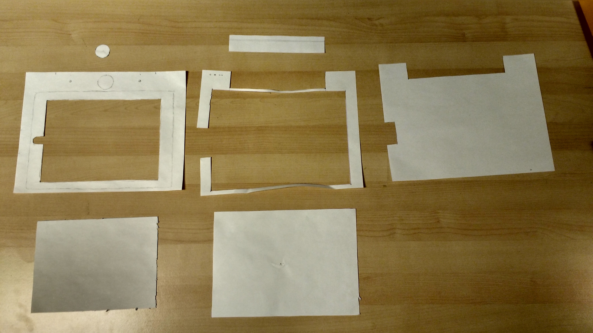

## Iteration 4: Cardboard prototype
The paper prototype led to a higher fidelity cardboard prototype. First, I replicated the paper cuts into the cardboard:

Then, I successfully tested the 'sandwich' that will hold the iPad:

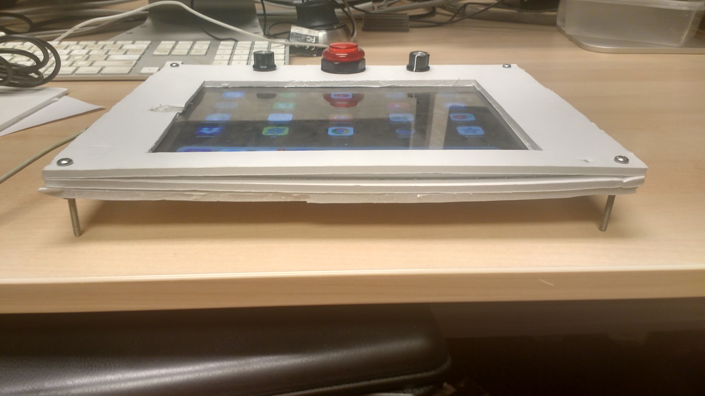

This version also allowed me to [remove the protoboard](https://github.com/jeraman/LL-Experiment-01/blob/master/research/circuits.md), and test the electronics as they are going to be in the final prototype. That's what I've come up with:

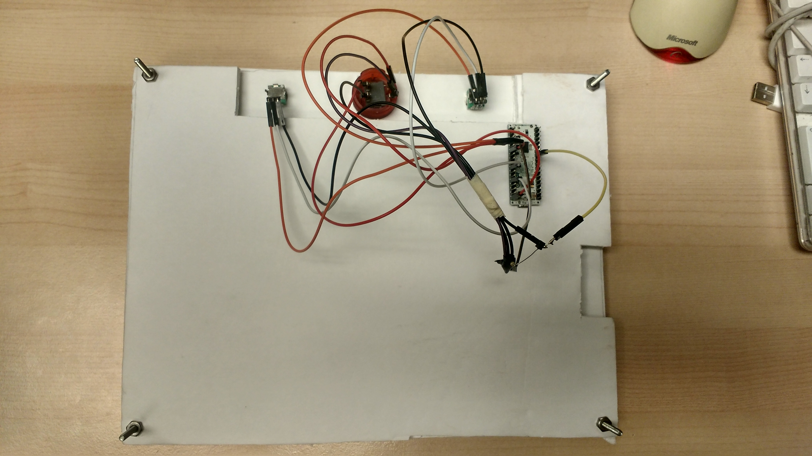

Then, I tried the standoffs:

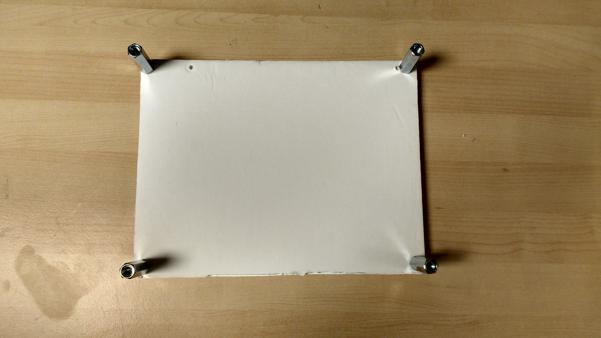

Finally, I added the USB hub and the FocusRite as if this was the final looper:

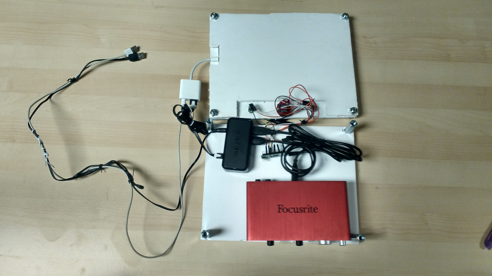

The result is still preliminary but seems quite solid, as you can see below:

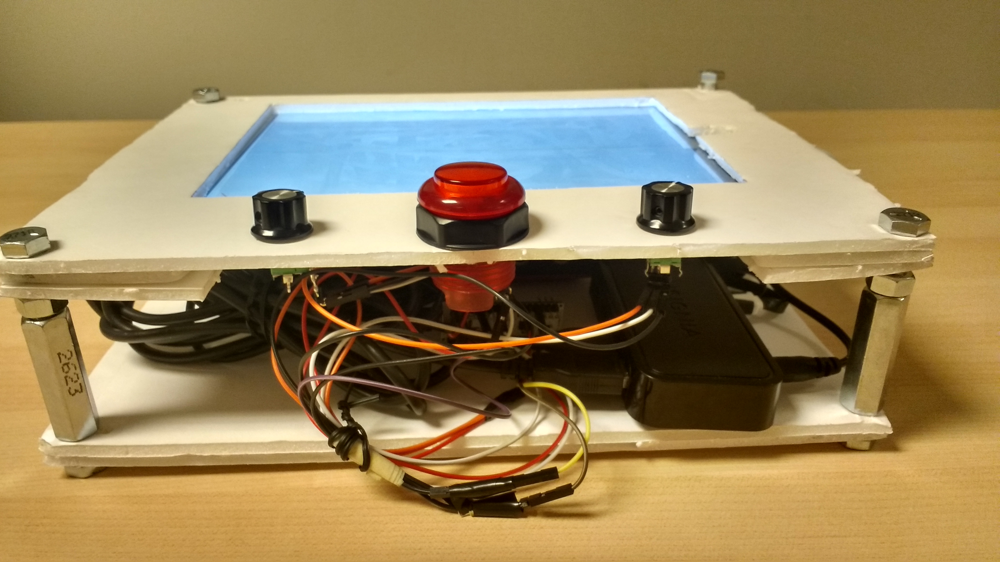

I loved this version, as it allowed to test almost every aspect of the final looper!

## Iteration 5:  Plexiglass prototype

After the last cardboard prototype, I decided to move on to a plexiglass box, built with laser cutting. Regarding this, I found a bunch of useful resources at [ITP's fabrication courses webpage](https://itp.nyu.edu/fab/). Yves was very helpful during this iteration (buy him a beer too). Key take-aways from my laser cutting experience are:

- When creating a new file, remember to use landscape mode and RGB as color scheme;
- Maximum size of page (for the Speedy 300 we have at CIRMMT) should be 28.7 x 16.7 Inches.
- Remove all overlapping lines form your drawing;
- _Cutting color_ should be red (RGB: 255,0,0), and _engraving color_ should be black (RGB: 0,0,0);
- _Cutting line weight_ should be 0.18 or less; Regarding _engraving_, weight directly translates to 'strenght' of the engraving;
- When saving files, compatibility must be set to CS 5 or downwards;
- Put your drawing (and the material inside the printer) on the top left part.
- They only have CorelDraw and Inkscape at CIRMMT, so make sure you use one of these for the final printing.

Both Illustrator (original) and Corel Draw (converted) files are available [here](./images/cardboard-v2-back.jpg).

**Important**
> None of these versions are 100% complete and correct. The Illustrator one has the correct hole size for potentiometer, but misses the FocusRite holes made by Yves. The Corel version has the correct FocusRite holes, but potentiometer holes have a smaller size. Fix this problem for future versions.

The result was looking good!

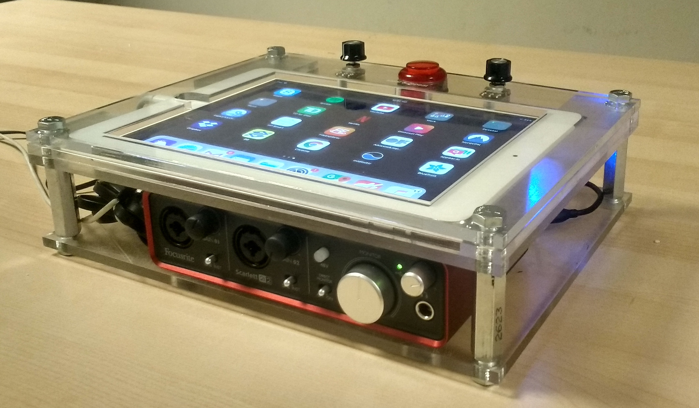

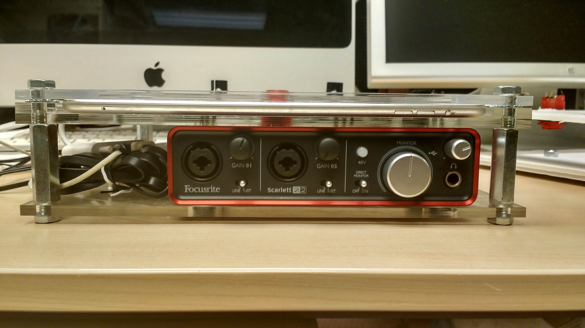
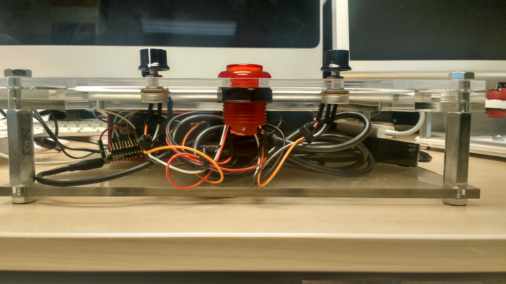

Also, Darryl was very helpful throughout the entire process. Remember to buy him a beer!

# Circuits

For the input controls, I wanted to replicate the Boss RC-1 that supports four types of events:
- Simple Press button;
- Press button twice (in less than a second);
- Press & Hold (during 2 seconds);
- Knobs events (both 'persistence' and 'phasing').

**To note:**
> This section reads as a tutorial.

## Materials & Steps
The circuit looks like the following:

As materials, you'll need:
- A 5v Arduino;
- A [Bluefruit board](https://learn.adafruit.com/introducing-the-adafruit-bluefruit-le-uart-friend/configuration) (Bluefruit LE UART Friend);
- A [button](https://www.adafruit.com/product/3489);
- Two [10k potentiometers](https://www.digikey.com/product-detail/en/tt-electronics-bi/P0915N-FC15BR10K/987-1649-ND/4780740) with [plastic knobs](https://www.adafruit.com/product/2047);
- One 10k resistor (you can find such resistor inside a [resistor kit like this one](https://www.sparkfun.com/products/10969));
- A bunch of [jumpers](https://www.sparkfun.com/products/14284);
- A [battery snap holder](https://www.sparkfun.com/products/91);
- A [rocker switch](https://www.sparkfun.com/products/8837).

My step-by-step to get the 'pedal' working was the following:
- [x] Get started on Arduino;
- [x] Bluetooth BLE board (Bluefruit & Arduino);
- [x] MIDI on Arduino;
- [x] MIDI BLE from Arduino to a Mobile;
- [x] Connect the button;
- [x] Connect the two potentiometers;
- [x] Connect battery and rocker switch;
- [x] Writing the Arduino code;
- [x] Test the circuit with the Steap & Repeat app;

Each step is detailed in the following subsections.

## Get started on Arduino!
Because there was no cable (get it ASAP!), decided to use my old Arduino Uno instead of the brand new Arduino Micro. I also updated Arduino's IDE software.

## Bluetooth BLE board
First, I soldered the connectors into the board. Then, I tested to see if the module was working all right by following the tutorial [here](https://learn.adafruit.com/introducing-the-adafruit-bluefruit-le-uart-friend).

In short, you'll need:

### Wiring
Just like in this image:

### Setting Adafruit's BLE on Arduino
For this I used [this tutorial](https://learn.adafruit.com/introducing-the-adafruit-bluefruit-le-uart-friend/software).

The tutorial is effective, covering things such as [configuring the board](https://learn.adafruit.com/introducing-the-adafruit-bluefruit-le-uart-friend/configuration); sketch examples (e.g. using [AT commands](https://learn.adafruit.com/introducing-the-adafruit-bluefruit-le-uart-friend/atcommand) from your computer to the board). By the end, you'll hopefully get your arduino, your BLE board, and you computer via serial port!

PS: Detailed documentation of AT commands can be found [here](https://learn.adafruit.com/introducing-adafruit-ble-bluetooth-low-energy-friend/standard-at).

### Testing the BLE with a tablet/smartphone
You can test communication with your Android/iOs doing as demonstrate in [this video](https://www.youtube.com/watch?v=4hWlDKzn7tA).

## Midi on Arduino
Arduino has a [MIDI library](https://playground.arduino.cc/Main/MIDILibrary). By following this tutorial [here](http://bvavra.github.io/MIDI_Accordion/sending-midi/), I was able to send continuous MIDI messages (rate: 1 per second) to my computer via serial. The code is available [here](./sketches/midi-demo/midi-demo.ino).

**Sidenote:** If I was to synthesize these notes on the computer, we would need someone like [the Hairless MIDI](http://projectgus.github.io/hairless-midiserial/) to route messages from serial to your MIDI synth. For my purposes, won't bother doing that.

## MIDI BLE from Arduino to a Mobile
Afterwards, my goal moved towards replicating the same 'MIDI on Arduino' example now over BLE to a mobile device, which will synthesize the notes.

It wasn't hard. The default MIDI example available on the Adafruits'BLE library seemed to have worked (almost) out-of-the-box:

- Inside the code, I needed to adjust the [configurations](https://learn.adafruit.com/introducing-the-adafruit-bluefruit-le-uart-friend/configuration) to use Software Serial (I have an Arduino Uno);
- Also needed to use Adafruit's BLE connect app to connect to the board;
- To route the MIDI to GarageBand, I used the [MidiMttr](https://itunes.apple.com/us/app/midimittr/id925495245?mt=8) app.

I think that was all. The sketch used is available [here](./sketches/midi-ble/midi-ble.ino).

**Sidenote 1:** Very often, I get errors when uploading the sketches to the board. These errors differ: Sometimes I get "Couldn't factory reset"; Sometimes, I get "Could not enable MIDI". Sometimes, fortunately, it works fine (i.e. "waiting for a connection"). Need to study why that happens.

**Sidenote 2:** Need to study how to make the BLE connection more reliable & straightforward (e.g. no need of external Adafruit's or MidiMttr app).

## Connecting the button
Regarding [Arcade buttons I use](https://www.adafruit.com/product/3489), there are two pairs of connectors: one pair for controlling the LEDs, another for using the button itself. For the LED connectors, [specification](https://www.adafruit.com/product/3489#technical-details-anchor) says there is no need to use resistors so that it is possible to connect the button directly to the 5v and GND (these have built-in 1k resistors). For the button, you can follow [this basic tutorial ](https://www.arduino.cc/en/Tutorial/Button) in order to read the button inside Arduino. Here, I used a 10k resistor.

I've modified this demo to work with the LEDs: if the button is pressed, the LED will light up. The code is [here](./sketches/arcade-button-LED/arcade-button-LED.ino).

## Connect the potentiometers
Also very simple step. Just follow this [example here](https://www.arduino.cc/en/tutorial/potentiometer). The code example is available [here](./sketches/potentiometers/potentiometers.ino).

## Connect battery and rocker switch
Simple as [this](http://www.instructables.com/id/Powering-Arduino-with-a-Battery/)!

## Writing the Arduino code
Once done with the hardware part, it's time to code a Arduino Sketch that will combine all previous points MIDI BLE, the button, and the potentiometers.

The resulting Arduino Sketch is available [here](./sketches/VRM-Interface/).

## Test the circuit with the iOS app
After some updates in the source code, and some fine tuning so that the visuals could match the physical controls, I was able to test this circuit with the VRM app! ;)

The final result can be watched in [this video](https://www.youtube.com/watch?v=3yMFNxZIu5M). Have fun! ;)

## Update: Port to USB
In order to remove intermediary software (Adafruit's BLE connect app) and simplify power supply, I've decided to replace the BLE module by standard USB connection.

After looking for recent references, I've found [this one here](http://www.instructables.com/id/Custom-Arduino-MIDI-Controller/) that seems to work. If you need further info, [this link](https://github.com/tttapa/MIDI_controller/wiki/MIDI-over-USB) covers different approaches to MIDI-over-USB in Arduino.

My case, in short:
1. Get an MIDI-over-USB compatible Arduino (in my case, the Arduino Micro);
2. Test the device with the 'Blink' example;
3. Install the MIDIUSB library, available in Arduino IDE library manager;
4. Use this sketch here as a test.

And we are ready to go! ;)

# Audio IO & Powering
Finally, I needed a reliable approach to deal with audio input & output, and powering the entire system. This is the setup I used:

For Audio IO, I used the [Scarlett FocusRite 2i2](https://us.focusrite.com/usb-audio-interfaces/scarlett-2i2) connected to the iPad via an [USB-lightning adaptor](https://www.apple.com/ca/shop/product/mk0w2am/a/lightning-to-usb-3-camera-adapter).  

For powering, I used a [small battery](https://www.amazon.com/JETech-2-Output-Portable-External-Battery/dp/B00T415OTS) to keep the whole setup portable. Also, it is possible to connect the iPad directly to a reliable source power the [USB-lightning adaptor](https://www.apple.com/ca/shop/product/mk0w2am/a/lightning-to-usb-3-camera-adapter). 

Hopefully, that's it! ;)
